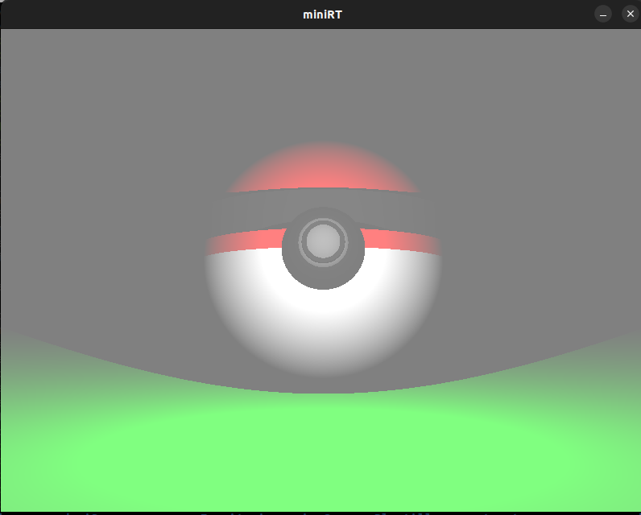
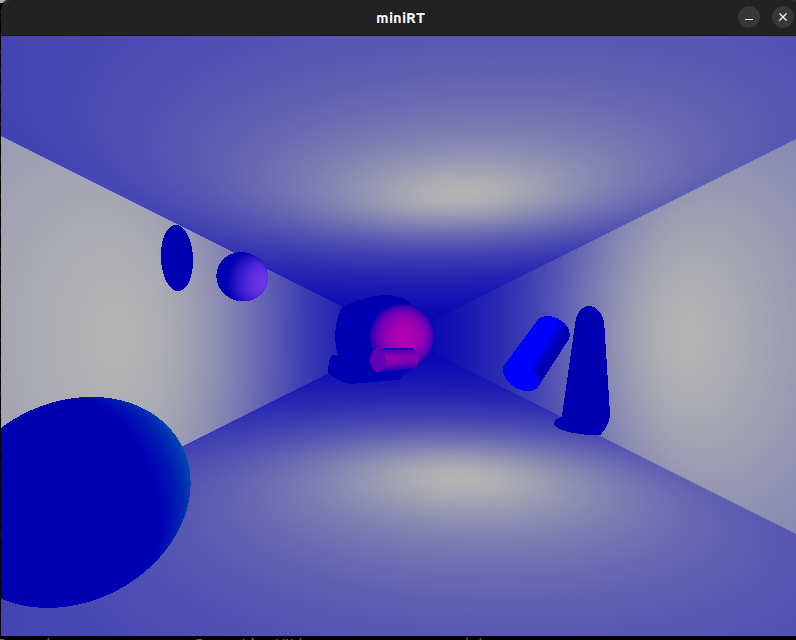

# miniRT

## About miniRT
This project is about to make a simple raytracer written in C with minimal dependencies.
It can handle basic figures like planes, cylinders and spheres with a single light point, also,
a camera point and its director vector. There is an ambient light too wich has contribute to the scene with color and intensity of light in a rate from 0 to 1.

The executable renderize the scene which is based on a file with a few rules to follow.

## How to use it
You can clone this repository by running the following command:
```bash
git clone git@github.com:NachoDonaire/miniRT.git
```
if you use ssh-key to your git account, but if you dont you can clone it via https.
```bash
git clone https://github.com/NachoDonaire/miniRT.git
```

Then, run the command make and, after a short wait, you will have an executable named miniRT.
```bash
make
```
After this couple of things, you are set to play with out mini raytracer. There is a couple of scenes in scenes folder.

For example:
```bash
cat scenes/pokeball.rt
C  0,-1,9,   0,-0.1,-1   60

L  0,0,4   0.7

A 0.5 255,255,255
pl 0,-2,0   0,1,0   0,255,0

sp 0,0.01,0   4.0   255,0,0
sp 0,0,0   4.0   255,255,255
sp 0,0,2.0   1.0   10,10,10
sp 0,0,2.2   0.72   255,255,255

cy 0,0,2.0   0,0,1   0.5   0.5   10,10,10
cy 0,-0.25,0   0,1,0   4.01   0.5   10,10,10

```

```bash
./miniRT scenes/pokeball.rt
```

<p align="center"> 

</p>


```bash
./miniRT scenes/pasillo.rt
```

<p align="center"> 

</p>

## rt extension rules
Each element first’s information is the type identifier (composed by one or two
character(s)), followed by all specific information for each object in a strict
order such as:
### Ambient lightning:
A 0.2 255,255,255
- identifier: A
- ambient lighting ratio in range [0.0,1.0]: 0.2
- R,G,B colors in range [0-255]: 255, 255, 255
### Camera:
C -50.0,0,20 0,0,1 70
- identifier: C
- x,y,z coordinates of the view point: -50.0,0,20
- 3d normalized orientation vector. In range [-1,1] for each x,y,z axis: 0.0,0.0,1.0
- FOV : Horizontal field of view in degrees in range [0,180]: 70
### Light:
L 40.0,50.0,0.0 0.6 10,0,255
- identifier: L
- x,y,z coordinates of the light point: -40.0,50.0,0.0
- the light brightness ratio in range [0.0,1.0]: 0.6
- (unused in mandatory part)R,G,B colors in range [0-255]: 10, 0, 255
### Sphere:
sp 0.0,0.0,20.6 12.6 10,0,255
- identifier: sp
- x,y,z coordinates of the sphere center: 0.0,0.0,20.6
- the sphere diameter: 12.6
- R,G,B colors in range [0-255]: 10, 0, 255
### Plane:
pl 0.0,0.0,-10.0 0.0,1.0,0.0 0,0,225
- identifier: pl
- x,y,z coordinates of a point in the plane: 0.0,0.0,-10.0
- 3d normalized normal vector. In range [-1,1] for each x,y,z axis: 0.0,1.0,0.0
- R,G,B colors in range [0-255]: 0,0,225
### Cylinder:
cy 50.0,0.0,20.6 0.0,0.0,1.0 14.2 21.42 10,0,255
- identifier: cy
- x,y,z coordinates of the center of the cylinder: 50.0,0.0,20.6
- 3d normalized vector of axis of cylinder. In range [-1,1] for each x,y,z axis: 0.0,0.0,1.0
- the cylinder diameter: 14.2
- the cylinder height: 21.42
- R,G,B colors in range [0,255]: 10, 0, 25

## About the leaky file
leaky.sh is a script only available if you have de leak command which appears by default in iOS computers. This file checks the existence of memory leaks in the program once the program is running.

## Disclaimer
The management of the window itself has been made using the MLX42 lib, a library made by 42 that contains functions to initialize and destroy a window as well as put pixels.

## Credit
The working repo is in my mate, friend and co-worker of this project @Daniexp profile. This has been developed between us.
